# Шаломеенко Иван Андреевич
shalomeenkoivan@gmail.com
+79516489072
Exercise2, VK "Midsprint"

- Основные ресуры, которые я использовал при выполнении этого здаания:
https://clickhouse.com/docs
https://youtu.be/TwyhnBDOHPw?si=VY3-mR3ejwbWbU29
https://habr.com/ru/companies/beeline_cloud/articles/864222/

# Запуск ClickHouse в Kubernetes

- Для выполнения задания по реализации полностью автоматизированной и параметризованной single-инсталляции ClickHouse хочу развернуть развернуть единый Pod в Kubernetes через официальный Docker-образ clickhouse/clickhouse-server с возможностью гибкой настройки версии и учетных данных пользователей без необходимости изменения кода манифестов.

## 1. Создание single-инсталляции ClickHouse

- Для подготовки локального Kubernetes-кластера к работе буду использовать minikube с Docker в качестве драйвера:
minikube start --driver=docker --memory=3072 (на всякий случай, чтобы точно хватило памяти)

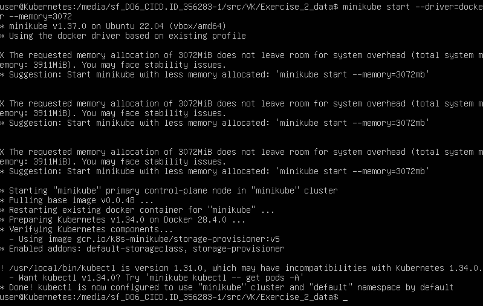

- Проверяю, что кластер работает:
kubectl get nodes

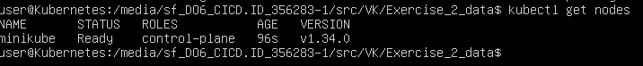

- Далее создаю Deployment-манифест для ClickHouse:
touch clickhouse-deployment.yaml

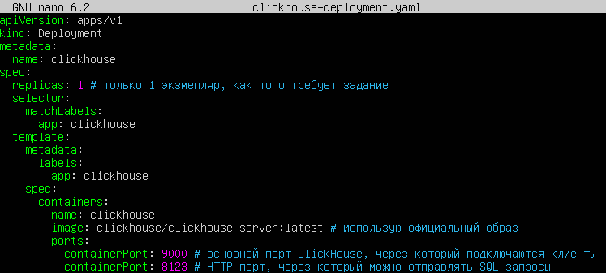

- Применяю манифест:
kubectl apply -f clickhouse-deployment.yaml

- Проверяю, что pod создался и работает:
kubectl get pods

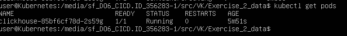

- Теперь необходимо выполнить ключевую проверку, что сервис действительно работает, а не просто контейнер запущен, для этого нужно попробовать "достучаться" до ClickHouse. По умолчанию Kubernetes запускает контейнер в отдельной внутренней сети, и порты не доступны снаружи. Поэтому нужно сделать "проброс" портов между хостом и самим pod внутри Kubernetes:
kubectl port-forward clickhouse-85bf6cf78d-w74qm 8123:8123 (первый порт - это порта хоста, второй - порт внутри контейнера в pod, где работает ClickHouse, а точнее его HTTP-интерфейс, примерно так же как в Docker: слева, где мы, справа - контейнер)

- Теперь по можно обратиться через curl к этому HTTP-порту ClickHouse:
curl localhost:8123 (отправил HTTP-запрос без параметров и получил ответ от ClickHouse)
curl localhost:8123:8123/?query=SELECT+1 (Clickhouse выполнил SQL-запрос и вернул 1)

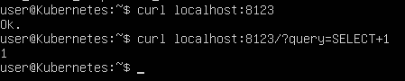

- Теперь точно все работает, а значит мы реализовали автоматизированное создание стандартной инсталляции ClickHouse в одном экземпляре, а значит, первый пункт задания выполнен и можно приступать к следующему!

## 2. Необходимо добавить возможность указывать желаемую версию ClickHouse

- В данном пункте задания нужно параметризовать манифест, чтобы версия ClickHouse могла меняться без редактирования файла. Для этого вместо жестко зашитой версии в манифесте (image: clickhouse/clickhouse-server:latest) можно вынести ее в переменную окружения.

- Создаю шаблонный файл манифеста:
cp clickhouse-deployment.yaml clickhouse-deployment.yaml.tmpl

- Редактируем шаблон:

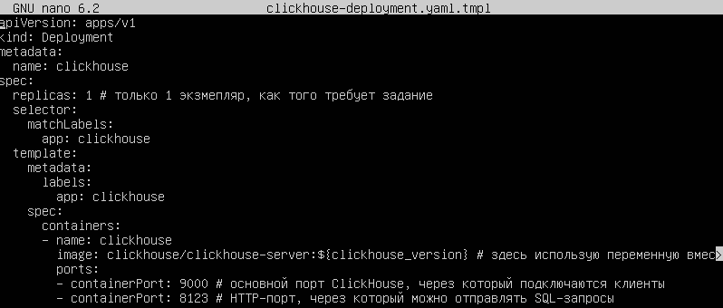

- Теперь напишем простой bash-скрипт, который будет запускаться с 1 агргументом: заданной пользоватальски версией образа ClickHouse:
touch start.sh
chmod +x start.sh

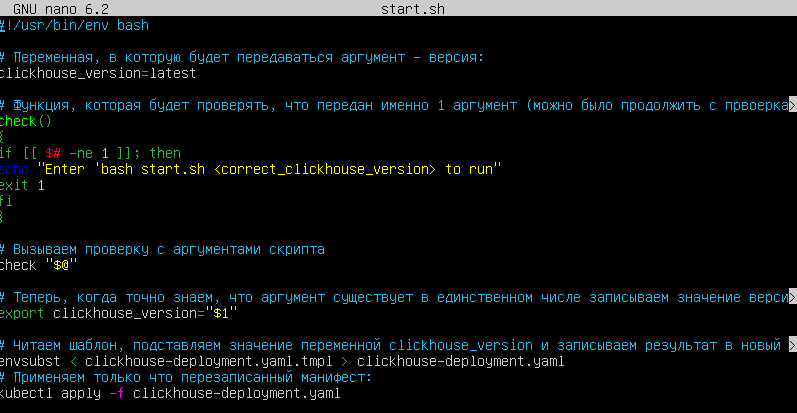

- Дальше нужно посмотреть все доступные версии ClickHouse для Docker, чтобы подобрать для теста:
https://hub.docker.com/r/clickhouse/clickhouse-server/tags

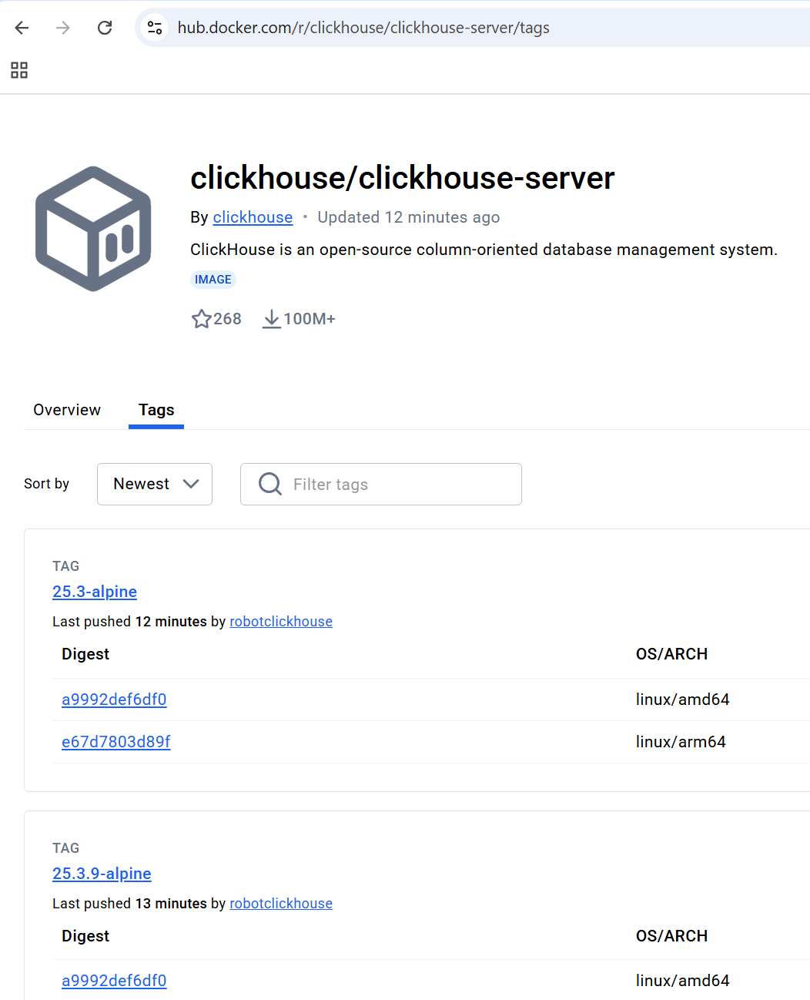

- Выберем, например, версию 25.10 (одну из последних) и запустим скрипт:
bash start.sh 25.10

- Проверим pod:
kubectl get pods

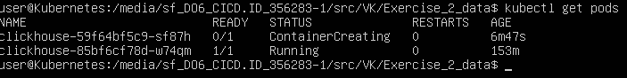

- Проверим, что образ скачивается:
kubectl describe pod clickhouse-59f64bf5c9-sf87h

# Ждем:)

- Тут я подумал, что загрузка зависла, запустил по новой (но оказалось, что просто так долго скачивается образ):
kubectl delete deployment clickhouse
bash start.sh 25.10
kubectl get pods

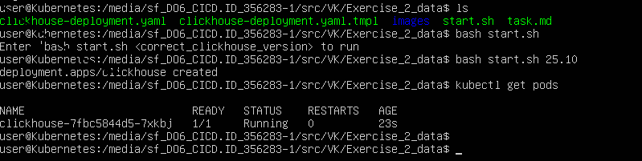

- Делаю контрольную првоерку работу сервиса:
kubectl port-forward clickhouse-7fbc5844d5-7xkbj 8123:8123 
curl localhost:8123

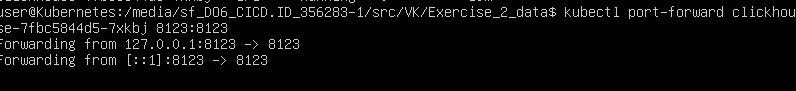

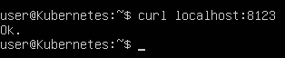

- Все работает, поэтому смело переходим к выполнению следующего пункта задания (№3)!

## 3. Необходимо добавить возможность указывать список пользователей с паролями для доступа к базе данных

- Чтобы реализовать добавление пользователей с паролями для доступа к базе данных безопасно и гибко, необходимо динамически задавать список пользователей и их пароли. В рамках задания я буду это реализовывать помощью Kubernetes Secret, что обеспечит хранение учетных данных в зашифрованном виде в отличие от ConfigMap.

- Для начала создам Service-манифест для доступа к ClickHouse, удобного проброса портов и внутренней маршрутизации (чтобы легко подключаться к сервису через единый адрес svc/clickhouse, а не искать новое имя пода каждый раз):
touch clickhouse-svc.yaml

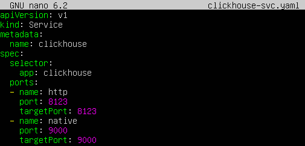

- Применяем толкьо что созданный манфифест вручную:
kubectl apply -f clickhouse-svc.yaml

- Проверяю успешное создание Service:
kubectl get svc

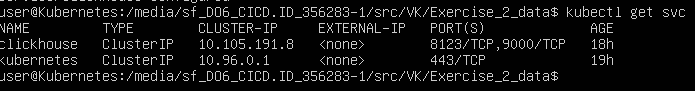

- Дальше нужно проверить работу HTTP-интерфейса, для это пробрасываю порты:
kubectl port-forward svc/clickhouse 8123:8123
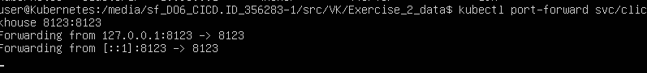

- Выполняю тестовый запрос:
curl localhost:8123

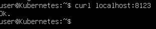

- Вывод "Ok" подтверждает, что интерфейс ClickHouse доступен по HTTP.

- Теперь можно модифицировать наш шаблон, чтобы было понятно, куда монтировать конфиг, а затем - убедиться, что шаблон готов принимать Secret, так как чтобы применять пользователей и пароли, ClickHouse должен сначала "увидеть" этот файл при запуске, потому что Kubernetes Secret сам по себе - только хранилище, и чтобы ClickHouse использовал данные из Secret, их нужно смонтировать в файловую систему контейнера в нужное место:
nano clickhouse-deployment.yaml.tmpl

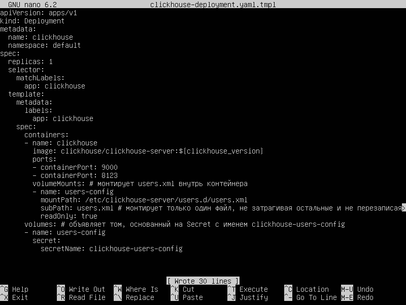

- Теперь переходим к выполнению основного требования этого пункта задания: основную логику развертывания попробую сохранить через тот же скрипт start.sh, добавив в него опцию создания логинов и паролей пользователей. И так как первоначально он был предназначен только для параметризации версии ClickHouse, теперь "слегка" нужно его модернизировать, чтобы из простого скрипта, который принимает одну версию и запускает Deployment, наш скрипт стал полноценной автоматизированной системой с безопасным управлением пользователями и графическим интерфейсом с подсказками! (из косметики, в том числе, сделаю основное меню бесклавишным и интерактивным):
nano -l start.sh

Строки 1-33:

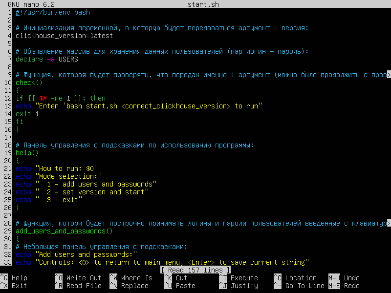

Строки 34-66:

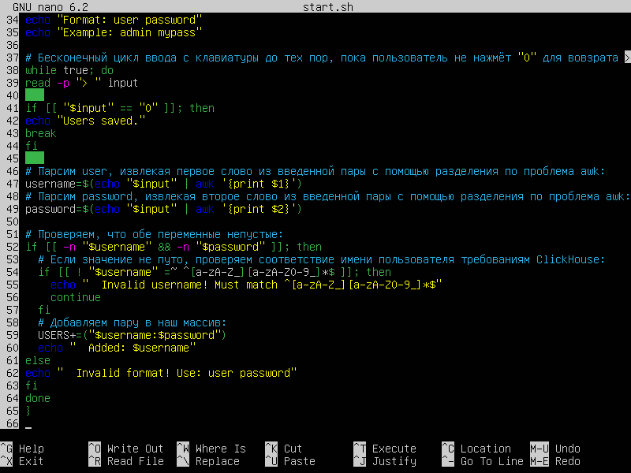

Строки 67-99:

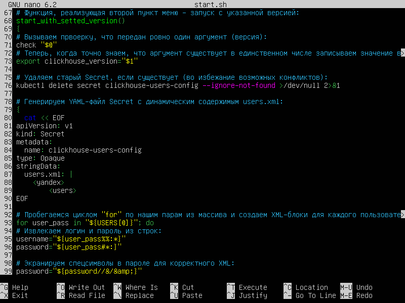

Строки 100-132:

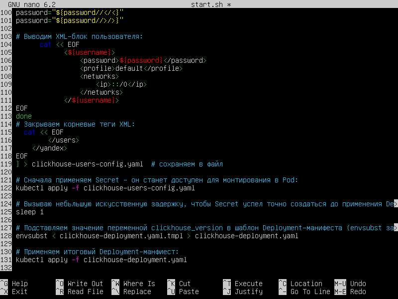

Строки 126-158:

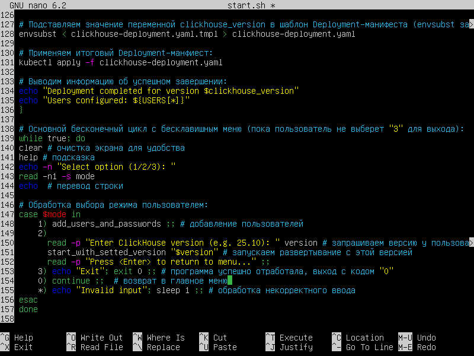

- Таким образом я переписал весь скрипт, чтобы он мог:
а) интерактивно собирать пользователей и пароли режиме 1 с помощью интерактивного меню, принимая данные по одному
б) хранить их в Secret (потому что пароли нельзя хранить в ConfigMap или в коде)
в) генерировать users.xml динамически, потому что статичный файл не позволит менять пользователей без редактирования файла
г) применять Secret, а затем Deployment (режим 2)

- Таким образом, я полностью переделал start.sh из инструмента запуска в безопасную систему управления, осталось только вручную проверить содержимое Secret и аутентификацию через clickhouse-client, и что после модернизации скрипта все работает безопасно и корректно.

- Для это зпустим скрипт:
bash start.sh

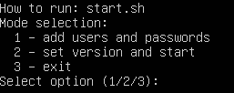

- Выбираем режим №1 и добавим пользователя admin с паролем adminpass:
1
admin adminpass
<Enter>

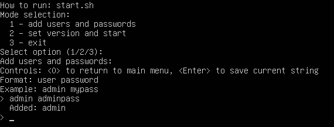

- Возвращаемся в главное меню и выбираем режим №2 и запускаем с версией 25.10:
0
<Enter>
2
25.10
<Enter>

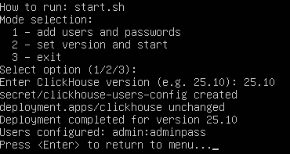

- Выходим из "программы":
<Enter>
3

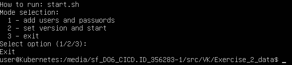

- Теперь проверим конфигурации пользователей в Secret, а именно что пользователь действительно сохраненился:
bash 1.sh (я скопировал команду из интернета "kubectl get secret clickhouse-users-config -o jsonpath='{.data.users\.xml}' | base64 -d" и поместил ее внутрь временного скрипта и запустил, чтобы не набирать вручную)

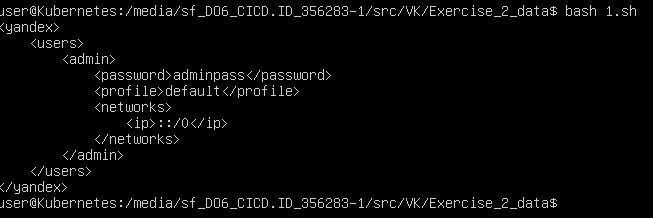

- Как результат данная команда показывает корректный XML-файл с корневой тегом <yandex> (стандартный namespace, используемый в конфигурационных файлах ClickHouse), локом <users>, содержащим пользователя <admin> и его пароль <password>adminpass</password>. 

- Это полностью подтверждает, что:
а) Secret успешно создан
б) Введенные данные сохранены
в) ClickHouse видит конфигурацию, которую получает при запуске

- Далее для полной проверки функциональности хочу выполнить аутентификацию с только что созданным пользователем для того, чтобы убедиться, что работает не только Secret, но и сам сервис, и работает корректно!

- Для этого выполняю проброс native-порта:
kubectl port-forward svc/clickhouse 9000:9000 &

- А дальше выполняю тестовый запрос с указанием наших логина (admin) и пароля (adminpass):
clickhouse-client --host 127.0.0.1 --port 9000 --user admin --password adminpass --query "SELECT 1"

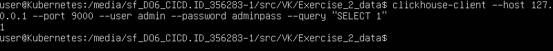

- Успешный возврат результата "1" подтверждает, что:
а) пользователь admin существует в ClickHouse
б) пароль adminpass корректен
в) авторизация и выполнение SQL-запросов работает корректно

- Таким образом, мы убеждаемся в том, что полностью смогли реализовать автоматизированную и безопасную, параметризованную single-инсталляция ClickHouse с поддержкой:
а) возможности указать желаемую версию ClickHouse через режим №2 программы start.sh
б) возможности динамически задавать список пользователей и паролей через интерактивное меню режима №1 все той же программы start.sh
в) хранения учетных данных в Kubernetes Secret

- Так как все требования задания теперь выполнены, осталось только написать README-файл, в котором предстоит описывать используемые для выполнения задачи технические решения:
touch README.md

Ссылка на публичный репозиторий со всеми файлами задания (task.md, /images со скриншотами, clickhouse-deployment.yaml, start.sh, clickhouse-deployment.yaml.tmpl, clickhouse-svc.yaml, README.md, а так же clickhouse-users-config.yaml, который создается автоматически в процессе работы start.sh):

https://github.com/shalomeenkoivan-del/vkmidsprint/tree/main/Exercise_2_data

